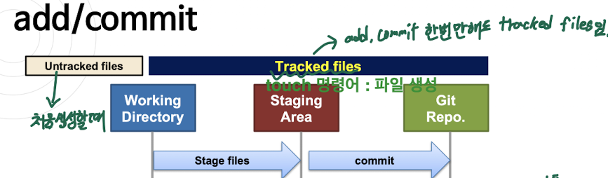

### Git 기초

1) 소스 관리는 어떻게?  
- 각 폴더가 무엇을 위한 버전인가?  
- 새 기능 개발하기 전 버전을 다시 어떻게 가져오는가?  
- 동료와 협업할때 소스관리 어떻게 하는가?  
등등  

2) 버전 관리 시스템  
- VCS(Version Control System)  
- 다른말 : SCM(Source Control System, Source Configuration Mangement)  
- 프로젝터 협업할때 소스코드, 문서 등 버전 관리 시스템  

3) VCS 종류  
- 1. CVCS(Centralized VCS) : 중앙집중식 (Clinet - Server 방식)  
    * 서버에 소스파일, 버전 히스토리 저장  
    * 단점 : 서버 고장나면, 협업 어려움  
    * 예 : CVS(Concurrent Version System), SVN(SubVersion)  

  

- 2. DVCS(Distributed VCS) : 분산관리 시스템  
    * 소스, 히스토리를 여러 PC에 분산 저장  
    * 장점 : 서버 고장나도 로컬 저장소 이용해 중앙 저장소 복원가능  
    * 예 : Git, Mercurial, Bazaar  

  

 4) Git VS Github  

- git : 분산 버전 관리 시스템 이며 로컬저장소(Local Repository) 사용 힘 즉, 프로그램!!  
- gitjub : 원격저장소 (Remote Repository), 제공하는 웹서비스!!  

  

5) Git : 사용자, 이메일 설정  
- Local PC 버전관리 : Git Bash 또는 terminal  
- Server 버전관리 : 서버 접속  
git config --global user.name "seongmin"  
git config --global user.email "holykim707@gmail.com"    

6) Repository 생성  
- 로컬 저장소  
mkdir hello : make directory hello  
cd hello : hello direcotry 들어가자  
--------------------------------- 위에 두줄은 git X  
git init : git으로 저장소 생성   
- 원격 저장소 복재  
git clone "http://~~"  

7) add/commit  
git add 파일명 : 해당 파일 add  
git add *.* : 파일 전부 add  
git add *.html : .html 확장자 파일 전부 add  

git commit : 빈화면 나오면서 메세지 기록 편집툴 실행 --> 메세지 입력  
git commit -m "commit msg" : 입력한 메세지로 commit  
git commit -am "commit msg" : 입력한 메세지로 add + commit  

단, untraked files 경우에는 -am 하지 말것 ! --> add 하고 난후, commit  

  

8) git rm  
git rm : untraked files 삭제  
git rm <filename> : 해당 파일을 로컬,git 에서 모두 삭제  
git rm --cached <filename> : 해당 파일을 git 에서만 삭제  

9) git status  
git status : 현재 파일 상태 확인  
untraked file 상태, Staged 전 상태, commit 전 상태 다 볼 수있음  

10) git log  
git log : commit 과련 기록 볼 수 있음  
git log --oneline : 한줄씩 볼 수 있음  
git log --aythor=Seongmin : 해당 author의 로그 볼 수 있음  

.png)  

git log --pretty=oneline --graph : 그래프로 예쁘게 볼 수 있음  

.png)  

11) git diff  
커밋 내역 비교하거나 commit , working tree 변경 내역 확인  

12) .gitignore 파일 (유용함!!!)  
- git 저장소에서 관리할 필요 없는 파일 이나 폴더 작성  
    1. 실행파일, 목적파일  
    2. Hidden file  
    3. Id/password 등 보안정보  
    4. 개인 파일  
    5. 실행파일 저장된 폴더(/bin, /out)  
- git 저장소 폴더에 .gitignore 파일생성  
- 개발환경, 언어별 작성 가능     